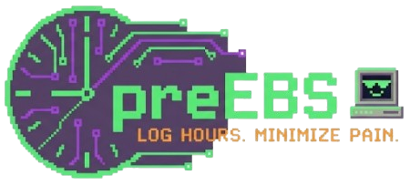

# PreEBS



Enter your hours in PreEBS, then import them into EBS with the included Chrome or Firefox extension.

## Workflow

1. Configure projects/tasks in `/config` (EBS name + optional human label).
2. Enter hours in `/week/[weekStartDate]`.
3. Export JSON from PreEBS. Hours use a comma (`"8,5"`).
4. Import JSON into EBS with the browser extension.

## Config import/export

In `/config`:

1. Click **Export Config** to download `preebs-config-YYYY-MM-DD.json`.
2. Click **Import Config** and select that file to replace the current configuration.

## CLI for AI agents

PreEBS includes a dependency-free CLI for inspecting configuration and booking hours. The web or desktop server must be running.

Run it from this repository:

```bash
npm run cli -- config
npm run cli -- weeks
npm run cli -- week --date 2026-09-25
npm run cli -- export --date 2026-09-25
npm run cli -- book --date 2026-09-25 --project PROJECT_ID --task TASK_ID --hours 7.5
```

Install the `preebs` command globally from a local checkout:

```bash
npm link
preebs config
```

The CLI automatically connects to a running PreEBS desktop app. Otherwise it uses `http://localhost:3000` by default. Set `PREEBS_URL`, or pass `--url`, when PreEBS runs elsewhere:

```bash
PREEBS_URL=http://localhost:43117 preebs config
```

`book` sets the hours for one date and project/task/hour-type combination rather than adding to them, making retries safe. It validates configured IDs, weekdays, half-hour increments, and the configured maximum hours per day. The hour type can be omitted when the task has exactly one.

`export` writes the selected week in the JSON format consumed by the Chrome and Firefox extensions. It defaults to `preebs-WEEK-MONDAY.json` in the current directory, or accepts a custom path:

```bash
preebs export --date 2026-09-25 --output ~/Downloads/ebs-hours.json
```

### Agent skill

Install the included skill so supported AI agents know the safe booking workflow and CLI semantics:

```bash
npx skills add Bethamil/preEBS --skill preebs
```

The skill source is in `skills/preebs/SKILL.md`.

## Chrome extension (JSON -> EBS)

Extension folder:

- `/Users/user/projects/PreEBS/chrome-extension/preebs-ebs-importer`

Install:

1. Open `chrome://extensions`
2. Enable **Developer mode**
3. Click **Load unpacked**
4. Select `/Users/user/projects/PreEBS/chrome-extension/preebs-ebs-importer`

Use:

1. Open EBS timecard page in Chrome
2. Click the extension icon
3. Paste `preebs-YYYY-MM-DD.json`
4. Click **Run Import**
5. Review and click **Opslaan** / **Doorgaan** in EBS

## Firefox extension (JSON -> EBS)

Extension folder:

- `/Users/user/projects/PreEBS/firefox-extension/preebs-ebs-importer`

Install:

1. Open `about:debugging#/runtime/this-firefox`
2. Click **Load Temporary Add-on...**
3. Select `/Users/user/projects/PreEBS/firefox-extension/preebs-ebs-importer/manifest.json`

Use:

1. Open EBS timecard page in Firefox
2. Click the extension icon
3. Paste `preebs-YYYY-MM-DD.json`
4. Click **Run Import**
5. Review and click **Opslaan** / **Doorgaan** in EBS

## Run locally

```bash
npm install
npm run build:web
npm run start:web
```

Open [http://localhost:3000](http://localhost:3000).

## Run as macOS desktop app (Electron)

Development mode (hot reload):

```bash
npm install
npm run dev:desktop
```

Production-like local desktop run:

```bash
npm run start:desktop
```

Create a macOS app bundle (`.dmg` + `.zip`) in `dist-desktop/`:

```bash
npm run build:desktop
```

`build:desktop` automatically generates a macOS app icon from `public/favicon.png`.
It also cleans previous desktop output before packaging to avoid recursive bundle inclusion.

Desktop data storage:

- Dev desktop mode: `~/.preebs-desktop/preebs-db.json`
- Packaged app: `~/Library/Application Support/PreEBS/preebs-db.json`

## Run with Docker

```bash
docker compose up -d --build
```

Open [http://localhost:43117](http://localhost:43117).
